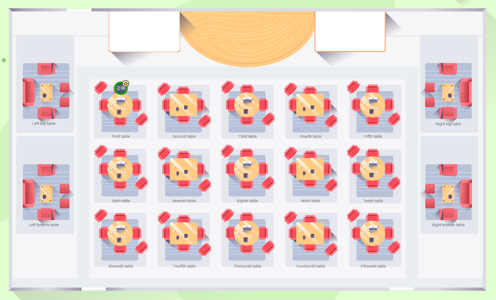

#  2021年4月度定例会 

### 開催日時

4/9(金) 19:30 ～ 21:00  

今回の定例会のテーマは、 **「今期のはじまりに心ひとつ組織一丸になって一緒に頑張っていこう」** です。

4月度定例会メイン Teams:  
https://teams.microsoft.com/l/meetup-join/19%3a4783ed85d7ff4ce28c90f29e2e16033d%40thread.tacv2/1617778129922?context=%7b%22Tid%22%3a%227e19d899-8805-4c1b-8e0e-00fe710963e4%22%2c%22Oid%22%3a%2247665828-a717-478d-a455-bd3a3dbfaaf2%22%7d

## ⬛ 🕢 タイムテーブル

<table>
    <tr>
        <th>時刻</th>
        <th>所要時間</th>
        <th colspan="2">内容</th>
        <th>担当</th>
        <th>概要</th>
    </tr>
    <tr>
        <td>19:30 ~ 19:35</td>
        <td>5分</td>
        <td colspan="2">スタート</td>
        <td>今立さん</td>
        <td>あいさつ、前回の振り返り</td>
    </tr>
    <tr>
        <td>19:35 ~ 19:55</td>
        <td>20分</td>
        <td colspan="2">① 社長からのお話</td>
        <td>社長</td>
        <td>年度はじめにあたってのお話</td>
    </tr>
    <tr>
        <td>19:55 ~ 20:00</td>
        <td>5分</td>
        <td colspan="2">② レクリエーションの告知</td>
        <td>近藤さん</td>
        <td>Teams でボードゲーム</td>
    </tr>
    <tr>
        <td>20:00 ~ 20:10</td>
        <td>10分</td>
        <td colspan="2">③ Good Job 賞</td>
        <td>中野さん</td>
        <td>今月は誰かな？</td>
    </tr>
    <tr>
        <td>20:10 ~ 20:25</td>
        <td>15分</td>
        <td colspan="2">④ 新卒紹介</td>
        <td>今立さん</td>
        <td>新卒の新入社員へのインタビュー</td>
    </tr>
    <tr>
        <td>20:25 ~ 20:40</td>
        <td>15分</td>
        <td colspan="2">⑤ 先輩インタビュー</td>
        <td>今立さん</td>
        <td>受託部 清水勝貴さんへのインタビュー</td>
    </tr>
    <tr>
        <td>20:40 ~ 20:43</td>
        <td>3分</td>
        <td rowspan="5">⑥ 組織紹介</td>
        <td>全体説明</td>
        <td>松田さん</td>
        <td>組織図を使って今期本社の組織を説明</td>
    </tr>
    <tr>
        <td>20:43 ~ 20:46</td>
        <td>3分</td>
        <td>管理部</td>
        <td>斧田さん</td>
        <td>管理部について説明</td>
    </tr>
    <tr>
        <td>20:46 ~ 20:49</td>
        <td>3分</td>
        <td>採用部</td>
        <td>今立さん</td>
        <td>採用部について説明</td>
    </tr>
    <tr>
        <td>20:49~ 20:52</td>
        <td>3分</td>
        <td>営業部</td>
        <td>中野さん</td>
        <td>営業部について説明</td>
    </tr>
    <tr>
        <td>20:52~ 20:55</td>
        <td>3分</td>
        <td>人事部</td>
        <td>近藤さん</td>
        <td>人事部について説明</td>
    </tr>
    <tr>
        <td>20:55 ~ 21:00</td>
        <td>5分</td>
        <td colspan="2">グループディスカッションの席へ移動</td>
        <td>―</td>
        <td>REMO のテーブルへ移動</td>
    </tr>
    <tr>
        <td>21:00 ~ 21:15</td>
        <td>15分</td>
        <td colspan="2">⑦ グループディスカッション</td>
        <td>―</td>
        <td>各テーブルでグループディスカッション</td>
    </tr>
    <tr>
        <td>21:15 ~ 21:20</td>
        <td>5分</td>
        <td colspan="2">おわりに</td>
        <td>今立</td>
        <td>みなさん、お疲れ様でした</td>
    </tr>
</table>

21:0 ～ 二次会

## ⬛ グループディスカッション

FS 4月度定例会 グループディスカッション | REMO  
https://live.remo.co/e/fs-4-1

### 💬 トークテーマ

- 志望部署とその理由
- 今何に力を入れているか
- 1～3月の目標とその進捗結果

## ⬛ 👨‍👩‍👧‍👦 チーム分けについて

以下にワークを行うチーム分けのメンバを示します（敬称略）。

## A テーブル 

本社: 今立唯子  奥原有貴  
**参加:** 羽賀文哉  住明日奈  大鹿悠蘭  木村弘樹    
**途中参加:** 服部睦  花木翔  吉森隆史   

## B テーブル 

本社: 斧田和弥  小林佳奈  
**参加:** 伊藤稚菜  稲垣来未  山田隆次  三村丈汰      
**途中参加:** 佐藤修一郎  森澤直之  （欠席：牧野祥太）    

## C テーブル    

本社: 近藤大揮  奥原有貴    
**参加:** 出井良樹  坂口智昭  赤木優輝  林大騎    
**途中参加:** 太田真康  水谷優汰  浄土高広    

## D テーブル   

本社: 今立唯子  奥原有貴  
**参加:** 丹羽拓也  吉村豊  濱田成美  鍛治宏旭    
**途中参加:** 小森未有希  塩崎永祐  石脇千穂        

## E テーブル    

本社: 今立唯子  奥原有貴     
**参加:** 高橋良和  西内優希  佐藤和輝  荒川貴詳    
**途中参加:** 中村晃輔  中島駿介  山田優一        

## F テーブル    

本社: 今立唯子  奥原有貴    
**参加:** 三輪一仁  亀田春樹  各務拓  佐藤貴一    
**途中参加:** 吉村公史  大林達矢  小林凌弥    

# ⬛ 二次会について

## 💬 二次会でのトークテーマ

- 通勤時間の使い方
- 落ち込んだときの対処法
- 健康で気を遣っていること
- モチベーション維持の秘訣
- 仕事とプライベートの切り替え方
- やってよかったこと/失敗したこと
- コミュニケーションで気を付けていること
